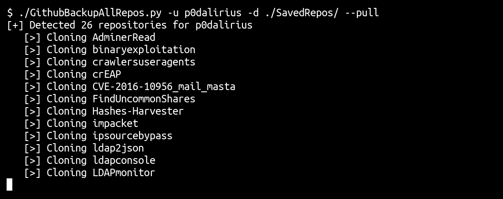
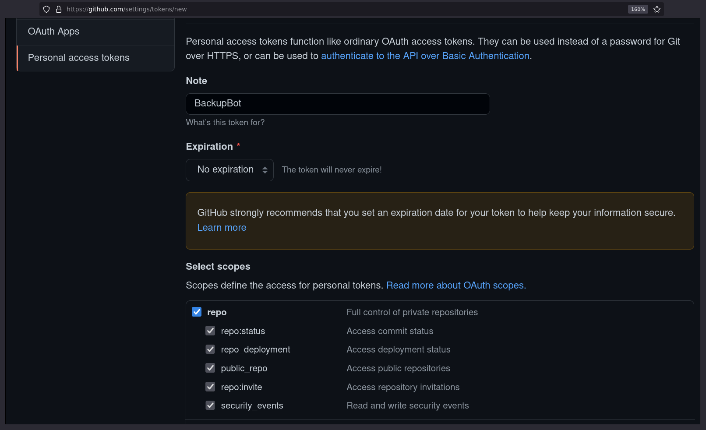

# GithubBackupAllRepos

<p align="center">
  
  <a href="https://twitter.com/intent/follow?screen_name=podalirius_" title="Follow"></a>
  <br>
</p>

A Python script to backup all repos (public or private) of a user.



## Features

 - [x] Clone public and private repos
 - [x] Load specified SSH key before starting backup
 - [x] Automatically lists all repos from Github's API
 - [x] Personal access token authentication to Github's API

## Usage

```
$ ./GithubBackupAllRepos.py -h
usage: GithubBackupAllRepos.py [-h] -u USERNAME [-d DIRECTORY] [-S SSH_KEY] [-T TOKEN] [-P] [-v]

Description message

optional arguments:
  -h, --help            show this help message and exit
  -u USERNAME, --username USERNAME
                        Target github username
  -d DIRECTORY, --directory DIRECTORY
                        Local directory to store repos into.
  -S SSH_KEY, --ssh-key SSH_KEY
                        SSH key to authenticate with.
  -T TOKEN, --token TOKEN
                        Github personal access token, necessary to list your private repos.
  -P, --pull            Perform git pull on existing directories.
  -v, --verbose         Verbose mode. (default: False)
```

## Examples

### Cloning all public repos of a user

```
./GithubBackupAllRepos.py -u TargetUser -d ./SavedRepos/ --pull
```

### Cloning all your public and private repos

```
./GithubBackupAllRepos.py -u YourUserName -d ./SavedRepos/ -S ~/.ssh/github -v --pull
```

## How to create a personal access token

To create a personal access token you need to go in `Settings > Developer settings > Personal access tokens` in your account, or at [https://github.com/settings/tokens/new](https://github.com/settings/tokens/new)

[](https://github.com/settings/tokens/new)

Everything is in Github's docs here:
 - https://docs.github.com/en/authentication/keeping-your-account-and-data-secure/creating-a-personal-access-token
 
## Contributing

Pull requests are welcome. Feel free to open an issue if you want to add other features.
